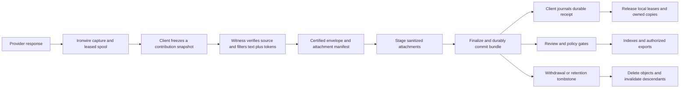

# Token log probabilities: capture, witness filtering, storage, and cleanup

Date: 2026-09-10. Status: implementation plan; no feature or production change is made by this document.

## 1. Outcome and scope

Capture the probability of each generated token and up to 20 provider-returned alternatives. Link those measurements to the exact model exchange and transcript revision. Have the witness filter token data alongside the transcript and certify the resulting bundle. Submit that bundle durably, index only approved projections, and clean up copies without losing pending submissions or deleting data owned by another application.

User decisions already made:

- Chosen-token log probabilities and top alternatives, not full-vocabulary logits.
- Use the witness's transcript redactions to identify token records to remove.
- Inspect alternatives independently, since they may contain content absent from the transcript.
- Retain original provider probabilities; missing/redacted values remain missing.

Recommended implementation decisions:

- Default maximum is 20 alternatives; distinguish requested, returned, and retained counts.
- The feature is opt-in, and capture and contribution are separate choices. Existing capture/consent settings do not silently acquire a new meaning.
- Token records are a versioned, bounded attachment. They are not appended to prompt text, ordinary logs, or a giant relational JSON column.
- Local cleanup follows a durable bundle receipt, not indexing, review acceptance, payment, or a generic HTTP success.
- Source transcripts belonging to Claude Code, Codex, OpenCode, or another application are never automatically deleted.
- Witness filtering reduces direct exposure; it does not establish that probability distributions are anonymous. Initially permit detailed attachments only in an explicitly authorized restricted research/export profile, not broad/public exports.
- Full-vocabulary capture, later model rescoring, and model-training/unlearning mechanisms are outside this implementation.

## 2. Verified baseline and change locations

Inspected remote heads: Trace Commons `cbb27dffeacf07d3d4216be62c9b9bb203a943ab`; Ironwire `74cd49c106b7dab9c35e82d92af6c14df27d594b`. Trace Commons currently pins this Ironwire revision. Recheck heads before opening implementation worktrees.

| Component | Current behavior | Primary change locations |
|---|---|---|
| Ironwire request capture | `capture.logprobs` requests chosen-token probabilities on translated Chat Completions routes; default off. Native forwarding has a byte-preservation contract. | `ironwire_core/src/config.rs`, `ironwire_proxy/src/pipeline.rs`, `ironwire_translate/src/chat.rs`, `docs/PROTOCOL.md`, passthrough/conformance tests |
| Ironwire persistence | Ledger stores confidence aggregates. Body capture holds verbatim upstream bytes, normally only the latest completed exchange per session. | `ironwire_ledger/src/lib.rs`, `ironwire_ledger/src/bodies.rs`, proxy completion/retention hooks |
| Embedded proxy | Desktop apps run Ironwire through its embedded lifecycle. | `trace-commons-contributor/src/daemon/private_inference.rs`, Ironwire `embed` options |
| Client association | Routing ledger/body references connect sessions to inference evidence; attested-body transport currently concerns the final call. | contributor `routing/{mod,ironwire,attested}.rs`, `source/mod.rs`, witness modules |
| Client preview | Approved envelope bytes are pinned. Pending pins expire after three days; store budget is 256 MiB. Terminal/unpinned previews are swept. | contributor `daemon/{approved_envelope,preview,queue,uploader,history,mod}.rs` |
| Client receipts | Local receipts contain submission ID, session hash, source, timestamp, and status. Existing successful statuses also include quarantine. | contributor `config.rs`, `submit.rs`; protocol `TraceSubmissionReceipt` |
| PII spans | Classifier spans use Unicode codepoint offsets and are converted to bytes. `SafePrivacyFilterRedaction` exposes text/report/summary, not a composed edit map. | protocol `privacy_filter_spans.rs`, `trace_contribution.rs`; server `redaction_witness/correspondence.rs` |
| Witness | Verifies offered inference evidence, redacts, strips raw inference bodies, serializes and certifies exact envelope bytes. It does not return a signed token attachment manifest. | server `witness_service/{mod,http,inference}.rs`, `redaction_witness/{certificate,verification}.rs`; contributor `witness/transport.rs` |
| Ingest | Verifies witness certificate against received bytes, then rescrubs/rebinds the envelope for storage. Existing envelope cap is 16,000,000 bytes, not the obsolete 2 MiB mentioned in some comments. | protocol envelope/receipt types; server `submit_trace_handler`, rescrub path |
| Artifact store | Scoped encrypted artifacts and object references exist; artifact API is currently JSON-oriented. | server `trace_artifact_{store,gcs,kek}.rs`, `trace_corpus_storage.rs`, DB implementations |
| Indexes and withdrawal | Existing object references, vector invalidation, derived/export membership, retention jobs, and account withdrawal already exist. Withdrawal traverses several stores because none alone is complete. | server `trace_gate_service.rs`, storage traits/DB, ingest withdrawal and retention handlers |

Do not infer deployed configuration from these source facts. Provider token support and receipt coverage remain qualification gates. Do not infer support from an API accepting unknown request fields.

## 3. End-to-end model

Three independent state machines are required:

1. **Local material:** capturing → frozen/leased → witnessed → approved/pinned → uploading → durable receipt recorded → cleanup pending → released.
2. **Server bundle:** staging → validating → committed, or staging/validation failed/expired. No consumer can read staging objects.
3. **Corpus processing:** quarantine/review → accepted → indexed/scored, with independent revoked/expired states. Scoring or payment failure must not require the client to retain already-durable bytes indefinitely.

Preserve existing queue statuses where possible. Add orthogonal transfer and cleanup state rather than overloading `Uploaded` or multiplying every queue state by every storage state.

## 4. Identities, schema, and byte bindings

### 4.1 Identity hierarchy

- Preserve existing `trace_id` and `submission_id` semantics. Add an immutable `bundle_revision` and `bundle_digest`; a same-ID quarantine remediation must not overwrite earlier provenance.
- Identify source exchanges by an opaque capture-store instance ID plus exchange ID. SQLite row IDs alone are not globally unique and can be reused after resets.
- Session IDs group exchanges but do not prove transcript membership. Do not join token data using timing, model name, approximate text similarity, or the routing-affinity conversation key alone.
- Every attachment identifies the source exchange, output choice, response segment/content channel, tokenizer identity if known, and the exact sanitized event revision it describes.
- Use tenant-scoped ownership and object keys. No cross-tenant content deduplication or publicly queryable raw-content digest index.

### 4.2 Proposed protocol records

Put client-visible contracts in the permissive `trace-commons-protocol` crate; server/gate-only policy contracts remain on the AGPL side. Proposed names, to finalize in the contract PR:

| Record | Required information |
|---|---|
| `TokenDistributionCapture` | Schema, exchange identity, requested and served model, revision/tokenizer when known, provider protocol, scoring semantics, sampling parameters, requested/returned K, completion/coverage state |
| `TokenRecord` | Choice/segment, original generated-token index, original response byte span when verified, chosen token bytes/ID if actually provided, chosen logprob, ranked alternative bytes/IDs and logprobs |
| `SanitizedTokenAttachment` | Sanitized event identity/digest, retained token records and byte spans in that sanitized event, explicit redacted/unsupported/truncated gaps, privacy policy version and provenance level |
| `AttachmentDescriptor` | Opaque artifact ID, kind, format/codec version, exact encoded-byte digest, decoded-content digest, encoded/decoded sizes, chunk count/order, coverage summary, scope/use restrictions |
| `ContributionBundleManifest` | Submission and bundle revision, envelope digest, ordered attachment descriptors, witness policy and source-verification coverage, consent binding |
| `DurableBundleReceipt` | Server identity, account/tenant binding, submission and bundle revision/digest, committed manifest digest, durability protocol version, timestamp, processing status, retention terms/version |

No secrets in `Debug`, diagnostic strings, standard status IPC, or audit rows. Hashes and IDs are content-free metadata, not necessarily anonymous; restrict their visibility too.

### 4.3 Numeric and alignment rules

- Store natural-log probabilities and explicitly distinguish pre-sampling, processed/sampling-policy, and unknown semantics. Do not guess from the field name.
- Preserve provider-returned values with a documented numeric encoding. Use finite FP64 initially for exact preservation of parsed JSON numeric values; only adopt FP32/quantization as an explicit format revision after measuring error. Do not promise bitwise preservation of the original JSON spelling.
- Specify a tagged representation for true negative infinity if a qualified provider exposes it; missing values and provider sentinels are not ordinary probabilities. Reject NaN, positive infinity, invalid positive log probabilities, and unsupported numeric encodings.
- Never invent token IDs or claim a tokenizer revision from a friendly model alias. Provider byte arrays may split UTF-8 codepoints; alignment operates on bytes, with classifier offsets converted explicitly.
- Require byte-exact reconstruction of each covered response segment before attaching positional data. If tool arguments, reasoning blocks, or translated output cannot be mapped exactly, mark that segment unavailable. Do not use greedy string matching.
- Output-token indices are scoped to choice and segment. Handle streaming finish frames, repeated transport frames, truncated streams, reconnects, and multiple choices explicitly.
- The chosen token is retained even if outside the top 20. Do not silently truncate the caller's own requested API behavior; storage can cap retained alternatives and record that cap.
- Preserve the original probability mass. Never renormalize after top-K truncation or redaction. Tail mass is only derivable when the provider's normalization semantics are known; distinguish unreturned mass from redacted alternatives. Do not label top-K entropy as full-vocabulary entropy.

### 4.4 Avoid digest cycles

Use a detached, canonical bundle manifest: hash immutable sanitized envelope bytes and attachment bytes first, then sign the manifest containing those digests. Do not insert the signed manifest back into the envelope whose digest it contains.

Retain the current v1 envelope certificate for compatibility if needed; introduce a versioned bundle certificate/profile for attachments. The new certificate binds consent, policy, exact attachment digests, and event associations, not merely filenames. Unknown bundle certificate versions fail closed for attachment upload.

## 5. Ironwire capture and local ownership

### 5.1 Request behavior and provider qualification

Add a new capture mode such as `token_distributions = off | chosen | top_k`, plus bounded `top_k` (default 20 when enabled). Keep the existing aggregate switch backward-compatible. Do not upgrade existing users from aggregates to raw token storage.

Qualify Chat Completions and Responses independently, streaming and non-streaming. Start with provider/model combinations proven by the qualification harness. Unsupported or unknown capability yields a named absence, not a fabricated measurement. Never switch model, credentials, reasoning mode, temperature, or route simply to obtain probabilities.

For native-protocol request augmentation, first amend `docs/PROTOCOL.md`'s enumerated opt-in mutation set and its conformance tests. Preserve all unrelated request bytes/fields; explicit caller preferences win. Cross-family translation must preserve caller-requested logprob semantics or explicitly refuse an unsupported user request. Collection-only preferences may remain unavailable without failing ordinary inference.

Record served-model substitution separately from requested model. Test whether probability data are covered by the provider's signed response. A provider receipt for one call does not attest a whole session or prove model identity beyond the actual verification policy.

### 5.2 Spool and leases

Introduce a bounded per-exchange capture spool for token data and required source evidence. Normal body capture keeps its current retention behavior; opt-in contribution capture uses a separate explicit retention policy instead of silently disabling body rotation for everyone.

- Write immutable chunks atomically; persist their descriptors before advertising readiness.
- Enforce private directory/file permissions and Windows ACLs. Keep raw content out of the SQLite metadata rows, control-API summaries, and report bundles by default.
- Acquire an atomic lease over an exact exchange/chunk set before export to the client. Leases contain an owner, random lease ID, source generation, snapshot digest, and bounded expiration; no arbitrary filesystem path comes from a remote receipt.
- Support multiple leases: two clients, two commons destinations, and a local user retention preference must not delete each other's data.
- A session snapshot lists exact exchange IDs. A late turn creates new material; acknowledging an older snapshot must never delete that turn.
- Extend rotation, age pruning, startup orphan sweep, and explicit removal to consult leases and pending publication state. A retention check and unlink must not race lease acquisition.
- Bound raw spool bytes globally and per session. At capacity, stop additional token capture and report missing coverage rather than evict active upload pins or break inference.
- An expired unrecoverable capture is recorded as expired; it is never silently replaced with a newer call's data.

Expose acquisition/read/release through the existing authenticated loopback control plane and an equivalent embedded API. Bind release to lease ID and exact snapshot digest. A receipt authorizes releasing the client's lease, not deleting every file for that session.

## 6. Witness filtering and certification

### 6.1 Produce an edit map, not a heuristic transcript diff

Extend the internal redaction result with an event/field-scoped edit map. Compose deterministic secret/path substitutions and classifier edits back to the original bytes. Existing classifier and correspondence offsets are codepoints: preserve that API contract, convert once, and label coordinate systems in all new types.

The map is private witness working data. Do not return removed strings, placeholder lookup tables, or original transcript offsets in public artifacts. Public gaps should carry only the minimum useful alignment information.

For each chosen-token record overlapping a redacted span, remove the entire record, including alternatives. Recompute spans for retained records against the sanitized event. Replacement placeholders have no token probability. If mapping is uncertain, omit the entire affected segment's token attachment; the transcript may still proceed if policy permits and the omission is certified before approval.

### 6.2 Alternatives require their own pass

Inspect alternative token bytes with the same secret/PII policy. Classification needs context: scanning each fragment as a standalone string is insufficient for names, credentials, and emails split across tokens.

Use bounded contextual candidate checks and the witness's private knowledge of detected sensitive spans/fragments. Candidates at adjacent positions are not a coherent sampled sequence; do not pretend concatenating equal-ranked alternatives creates one. The policy must specify what combinations it examines, cap work, and drop uncertain records/segments when that budget is exceeded. This is a measured detector, not a proof that every possible alternative sequence is PII-free.

Remove a flagged alternative without changing other probabilities. Allow a stricter policy to remove its whole position or segment. Include an allowlisted reason and coverage summary, not the sensitive material. Tests must cover PII appearing only in alternatives and multi-token secrets.

### 6.3 Conditioning risk and trust labels

Record whether the provider saw outbound-substituted context, original context, or unknown context. The witness's later transcript edits do not retroactively change that conditioning. Detailed attachments remain restricted under the initial policy; broad export requires a separately qualified policy, not a “PII passed” boolean.

Verify original upstream evidence before transformation. Derive token records directly from those bytes inside the witness where possible; otherwise validate any client-provided token record against them. Never certify arbitrary client-supplied distributions merely because the surrounding transcript had a valid receipt.

Certification distinguishes `provider_response_verified`, `witness_filtered_only`, and unsupported/missing evidence. Each exchange has its own coverage. Earlier calls cannot inherit the final call's receipt.

### 6.4 Witness input bounds and raw-data lifetime

The witness alone receives raw evidence under the existing attested transport. The ordinary ingest/staging service receives only sanitized attachments.

Start with strictly bounded requests/chunks and concurrency. If full selected-session evidence exceeds that bound, witness per-exchange chunks and then certify an ordered aggregate manifest binding their event IDs/digests and policy; do not increase a request limit without bounding enclave memory. Partial results cannot be labeled a fully witnessed session.

Prefer in-memory processing. If qualification proves temporary spooling is necessary, design encrypted enclave-owned temporary storage with request-scoped keys, expiry, crash cleanup, and no raw object-store/log persistence. Completion, cancellation, disconnect, and errors release witness-owned material. Classifier errors never downgrade to an unfiltered attachment.

## 7. Client review, submission, and crash recovery

Freeze the transcript snapshot and its exact exchange attachment set before witness review. Hold leases while reading source material. The returned manifest, envelope, attachments, verdict, grants, and review fingerprint form one approval pin.

Store only sanitized witnessed artifacts in the approved-artifact store. Account for attachment bytes in the existing aggregate budget; the old 256 MiB envelope budget must not become an unbounded additional sidecar budget. Raw token data remain in the leased source spool and only travel to the witness.

An approval authorizes that exact bundle. If bytes, consent, selected calls, or verdict change, rebuild/review and issue a new bundle revision. In particular, do not use the ordinary post-preview verdict-stamping exception to mutate witnessed bytes.

Proposed upload sequence:

1. Negotiate bundle/certificate/codec support and limits with the server. Old servers get the existing transcript-only path only after that omission is reflected in the preview; never silently drop an approved attachment.
2. Begin an authenticated upload session for a manifest digest and idempotency key.
3. Upload sanitized immutable chunks; server verifies byte counts/digests and acknowledges each chunk. Resume missing chunks after restart.
4. Finalize with the exact certified envelope and manifest. A chunk acknowledgment is not permission to delete the bundle.
5. Validate the server's durable receipt against the configured server/account, bundle revision, and all attachment digests. Persist it atomically with cleanup intent before releasing any upload material.
6. Reconcile queued cleanup with Ironwire, then remove unneeded client-owned sanitized copies. Preserve the small receipt and state needed to avoid resubmission.

Lost finalize responses are resolved by authenticated lookup using the same idempotency key and manifest digest. A repeated key with different bytes is a conflict. Never infer commitment from elapsed time, a bare submission ID, or an existing receipt for an older revision.

Use an append/recovery-safe journal or equivalent transaction covering receipt and cleanup intent. If the server commits and the client crashes before persistence, recovery queries the server first. If the receipt cannot be written locally, retain data and report `receipt-write-failed`, extending existing behavior.

## 8. Server upload, storage, and bundle commitment

### 8.1 Additive storage model

Extend existing object references and encrypted artifact providers instead of introducing a second unrelated storage system. Add explicit token attachment/manifest artifact kinds to both storage enums and stable KEK context mappings. A raw byte/chunk API is needed alongside the existing JSON API; do not JSON/base64-wrap large compressed attachments just to fit it.

Proposed tenant-scoped tables or equivalent additions:

- `trace_bundle_revisions`: submission, immutable revision/manifest digest, witness receipt reference, received/stored envelope digests, policy/consent versions, commit state, timestamps, lifecycle generation.
- `trace_attachment_descriptors`: revision, artifact ID/kind, encoded/decoded digests and sizes, object generation, codec, coverage, expiry/deletion state. FK/unique constraints prevent cross-bundle reassignment.
- `trace_exchange_links`: revision/event → capture exchange identity, sanitized response digest, attachment ID, verification coverage. No raw prompts or token arrays.
- `trace_upload_sessions` and chunk rows: authenticated owner, idempotency key, expected descriptors, completion state, expiry.
- Durable processing/deletion outbox entries, reusing current job machinery where compatible.

Force RLS and reuse auth-derived tenant predicates. Preserve principal ownership checks independently of tenant membership. New object kinds use tenant/submission/revision/artifact/format context for encryption and verification. Distinguish plaintext content digests from ciphertext hashes throughout.

### 8.2 Finalization guarantees

An object store and PostgreSQL do not share a transaction. Stage immutable objects first, verify their existence/integrity under the provider's durability contract, then commit the revision/descriptors plus processing outbox in a DB transaction. Staging references cannot be consumed by indexes or exports. Failed commits leave reclaimable orphans, not partial live bundles.

Issue a durable receipt only after that commit. Repeated finalize returns the same committed identity. Require the production durable-storage capabilities for this protocol; a legacy file/optional-mirror mode must not advertise the stronger cleanup guarantee until it passes an equivalent crash-recovery contract.

Receipts can be authenticated through the server's authenticated API for local cleanup. If portable signed receipts are added, pin the server key and signature context; a witness signature alone is not a server durability acknowledgment. Do not add an unneeded signing-key dependency to the first milestone.

Garbage collection must atomically claim expired staging sessions before deleting objects. Finalization and GC cannot both win. Pin object generations and ensure multipart/compressed/chunked uploads have size, count, decompression-ratio, CPU, and tenant-quota bounds.

### 8.3 Preserve witness and rescrub semantics

Ingest currently verifies the incoming witness bytes and then rescrubs the envelope. Preserve separate immutable received/certified and stored-derivative identities; never describe the modified stored envelope as the exact witness-signed artifact.

If ingest, the PII backstop, or a later review changes token-bearing text, invalidate the corresponding attachment linkage immediately. Re-witness/refilter against an authorized source if available, or store a transcript-only derivative with explicit missing coverage. Do not keep old token offsets alongside changed text.

The durable receipt names the uploaded certified bundle, while subsequent processing revisions have their own identities. A server may safely hold committed data in quarantine; that status does not prevent local cleanup, provided the receipt promises the complete bundle is retained for its stated retention period.

## 9. Indexing, linking, scoring, and export

- Index sanitized transcript text through the existing text/vector path. Exclude token strings, alternatives, raw source bodies, and probability arrays from ordinary full-text/vector indexing, gate prompts, summaries, and search snippets.
- Add relational, policy-gated metadata filters for attachment presence, K, retained coverage, served model, tokenizer availability, scoring semantics, and witness verification level. Keep absent, redacted, truncated, and unsupported separate.
- Associate every derived summary/vector/training export with `(tenant, submission, bundle revision, event/attachment digest, processing policy version)`. A mutable submission ID alone is not sufficient lineage.
- Compute cheap chosen-token surprise/coverage summaries as a separate versioned processing step. Avoid calling these correctness scores or calibrated confidence. Numeric comparisons across tokenizers/models/processed semantics require a declared analysis policy.
- Keep token features out of credit allocation initially. Otherwise enabling capture changes incentives before measurement quality and gaming resistance are evaluated.
- Make indexing idempotent for an immutable revision. Existing gate evaluation can insert vectors; audit insertion-before-outcome failures and prevent retries from comparing a trace against its own prior insertion. Scope any fix to this integration rather than assuming a four-phase pipeline refactor is already deployed.
- Index readers, export workers, and final export publication all recheck active revision, consent, and revocation generation. A cached “accepted” result is not sufficient.
- Restricted exports include the exact sanitized attachment manifest, tokenizer/model metadata, omission masks, semantics, policy, and provenance. Standard replay/text-only export remains unchanged. Do not export a redacted placeholder with an original token's probability.
- Trace deduplication must not discard distinct model-exchange distributions. Keep text similarity/novelty identity separate from bundle attachment identity.

## 10. Cleanup and retention contract

### 10.1 Ownership table

| Material | Owner | Default cleanup trigger | What remains |
|---|---|---|---|
| Original agent transcript | Coding agent/user | Never automatic in this feature | Original file unchanged |
| Ironwire raw response/token chunks | Ironwire | All relevant leases released after durable receipt, or explicit discard/declared expiry | Minimal exchange metadata and coverage/cleanup state under its own retention policy |
| Client-owned raw export copies, if any | Contributor | Prefer no copy; otherwise same lease/receipt rule | No raw payload |
| Witness transient raw input/edit maps | Witness | Completion, refusal, cancellation, or bounded recovery expiry | Certificate and allowlisted operational counters only |
| Approved sanitized envelope/attachments | Contributor | Durable receipt journaled and no remaining local review/retention owner | Content-free receipt, revision IDs, cleanup state |
| Incomplete server uploads | Server | Expired staging session claimed by GC, never a concurrent commit | Bounded failed-upload metadata |
| Committed server envelope/attachments | Server | Authorized withdrawal or retention policy | Tombstone, necessary audit/receipt metadata, deletion status |
| Derived indexes/exports | Respective service | Parent revoked, expired, superseded, or policy-invalidated | Provenance/invalidation record; no active content |

### 10.2 Local cleanup is a durable worker

Persist `cleanup_pending` before making delete/release calls. Each item identifies only owned objects, immutable revision/digest, lease, and a reason. Retry failures with bounded backoff on startup and normal maintenance. A successful submission can have pending cleanup; surface that state rather than resubmitting or claiming disk was cleared.

Delete/release exact immutable objects through their owning service. Use compare-and-delete under the same lock/transaction as reference checks; reject mismatched generation/digest, symlinks/reparse points, path traversal, and caller-supplied absolute paths. This must work when the embedded proxy is stopped: start a bounded maintenance path or leave cleanup queued, not a direct unsafe unlink.

Multi-target submission releases only the acknowledged target's lease. Continued recording is independent. Local “keep a copy” adds a separately bounded owner; it does not change remote retention. Logout clears owned local material using existing wipe rules and records/retries cleanup where possible; it must not imply withdrawal from every server.

Keep normal receipt/history entries free of content and raw paths. Bound their own retention while preserving anti-replay/duplicate state as required. Do not accidentally rediscover and resubmit a trace immediately after pruning its only duplicate marker.

User-visible operations must distinguish:

- **Remove local copies:** Ironwire/Trace Commons-owned captures and previews; leaves original agent files and server submissions alone.
- **Withdraw contribution:** stops server use and schedules/verifies deletion of stored and derived artifacts; does not delete agent files.
- **Discard unsubmitted capture:** explicit irreversible loss of that capture, not a successful submission.

### 10.3 Server deletion traverses the entire lineage

Extend current withdrawal/retention traversal to every bundle revision, attachment chunk, encoded variant, staging session, worker temporary, object generation, index projection, and export membership. Enforce holds and retention restrictions through existing policy; report blocked/pending/completed states truthfully.

Write the access-blocking tombstone and increment the lifecycle generation before asynchronous deletion. Reads stop immediately. Workers must recheck generation before publishing results so a scoring/indexing worker cannot resurrect a deleted parent. Repeated withdrawal resumes incomplete work and does not create a new tombstone identity.

Delete all provider object versions according to the configured backend policy, and verify deletion/invalidation receipts before reporting completion. Object versioning, soft-delete windows, backups, and external export copies require explicit retention/distribution reporting. Deleting a key reference is not proof of cryptographic erasure if wrapped keys and a usable KEK survive in backups.

A completed managed-store deletion does not promise removal from third-party exports, immutable backups before expiry, or already-trained model weights. Preserve the existing distribution-reach distinction and credit policy rather than redefining either in this feature. Test backup restore: tombstones must replay before consumers or indexes become available.

### 10.4 Initial resource targets to qualify

Proposed starting limits, not measured capacity claims: 8 MiB decoded attachment chunks; 32 MiB decoded token attachments per contribution snapshot; 512 MiB Ironwire token/evidence spool budget with separately accounted raw-body limits; use the existing 256 MiB client approved-artifact budget for envelopes plus attachments combined; 24-hour incomplete-upload expiry; retain the existing three-day unapproved-preview expiry.

Raw per-exchange evidence and witness request limits need separate measured bounds because prompts can dwarf token attachments. Keep active leases renewable and bounded by an explicit maximum capture lifetime; negotiate expiration and warn before loss. Do not silently extend the 90-day metadata retention to raw token data. Pressure pauses new capture instead of evicting pinned approved uploads.

Prefer cleanup on the next normal maintenance pass after durable receipt. Expose pending bytes and reason; do not promise secure disk erasure or an exact completion time while a daemon is offline.

## 11. Implementation sequence and review units

Use isolated worktrees; preserve dirty primary checkouts. The units below describe separable work and dependencies, not authorization to spawn agents or deploy before gates pass.

| Unit | Scope and deliverable | Depends on | Merge/acceptance gate |
|---|---|---|---|
| P0: provider qualification and fixtures | Synthetic streaming/non-streaming probes; supported model/protocol matrix; provenance and overhead report; no real user prompts | None | Returned values, semantics, alignment, and signed coverage measured or explicitly unknown; no silent route/sampling changes |
| P1: shared contracts | Token/manifest/receipt/revision DTOs, canonicalization vectors, bounded decoding, omission vocabulary and consent profile | Plan decisions | Cross-language and compatibility fixtures; unknown versions fail closed; no license-boundary violation |
| P2: Ironwire capture | New opt-in capture mode, request mutations, native/translated conformance, immutable bounded token chunks | P0/P1 | Streaming/finish/cancel/retry tests; existing native forwarding and caller preferences preserved |
| P3: Ironwire leases and cleanup | Snapshot leases, byte budgets, acquire/read/release API, rotation/GC coordination, embedded parity | P1/P2 | Multi-owner, late-turn, crash, expired-lease, prune-race and path/ACL tests |
| P4: witness token filtering | Composed original-to-sanitized edit map, source-byte validation, alternative screening, bundle certificate and bounded processing | P1/P0 | PII/alignment attack fixtures; no raw content in output; certificate tamper and source-mismatch tests |
| P5: artifact and DB foundation | Byte/chunk artifact API, kinds/KEK contexts, bundle revisions/descriptors/links/upload sessions, RLS and deletion lineage | P1 | PostgreSQL isolation/constraints, encrypted-object readback, migration and orphan recovery tests |
| P6: durable bundle API | Begin/chunk/finalize/readback, quotas, authenticated idempotency, transactional outbox, rescrub revision handling | P4/P5 | Fault injection across every object/DB/response boundary; no premature durable receipt |
| P7: client transfer and approval | Snapshot association, lease ownership, witness bundle preview, exact approval pin, resumable upload, receipt journal | P3/P4/P6 | End-to-end mocked pipeline, lost-response recovery, revision/grant changes, old-peer negotiation |
| P8: indexing and exports | Metadata filters, safe summary projections, exact lineage, restricted export, revision-aware idempotency | P5/P6 | No alternatives in ordinary text/vector surfaces; no cross-tenant joins or self-duplicate retry scoring |
| P9: cleanup and withdrawal integration | Client cleanup worker, all-revision server deletion, GC/finalize exclusion, worker resurrection prevention | P3/P5/P6/P7/P8 | Durable receipt-to-deletion crash matrix; withdrawal while uploading/indexing/exporting; backup/tombstone rehearsal |
| P10: desktop/CLI controls | Shared enablement/privacy wording, byte/coverage status, local cleanup versus withdrawal, Windows/macOS/Linux parity | P7/P9 | Native platform tests; no raw token content in default IPC/history/notifications; account/source boundaries enforced |
| P11: integration and rollout | Advance actual merged Ironwire SHA, both lockfiles and Flatpak vendor source set; feature gates, qualification report and runbook | All required units | Workspace/FFI/platform/release gates plus bounded live pilot; cleanup is a launch requirement |

P2/P3 remain upstream in Ironwire. P4–P10 belong in Trace Commons. P5's binary artifact primitive is shared by ingest, export, and retention; do not bolt a second untracked blob system onto P6. Add modules beside the large ingest binary rather than expanding unrelated inline logic.

Deliverable milestones:

1. **Capture proven:** bounded local capture and leases, synthetic/provider evidence, no contribution enabled.
2. **Witness bundle proven:** exact source validation and redaction/certification fixtures; no general upload enabled.
3. **Durable handoff proven:** resumable bundle storage and receipt journal, cleanup and withdrawal fault tests pass.
4. **Restricted consumption proven:** indexes/export lineage respect policy and deletion; no token-based credit changes.
5. **Cross-platform pilot:** explicitly opted-in cohort, observable costs/coverage/cleanup, then staged general availability of the opt-in feature.

## 12. Required tests and qualification

### Fidelity and privacy

- Exact original response reconstruction; Unicode, split UTF-8 token bytes, combining marks, repeated strings, JSON escapes, multiple choices, tool-call segments, missing IDs/tokenizer metadata.
- Streaming final-frame logprobs, duplicate frames, partial streams, cancellations/restarts, provider sentinels, malformed values, top-K caps, unsupported providers, caller-supplied `logprobs: false`.
- PII wholly inside one token, crossing token boundaries, redacted prompt-only PII, PII solely in alternatives, deterministic and classifier edits composed together, classifier outage and bounded candidate exhaustion.
- No original PII in sanitized attachment, debug output, metrics, history, or certificates. No renormalization; correct gaps and sanitized offsets.
- Swapped source exchange, mismatched tokenizer, forged token arrays, reordered/missing chunks, altered alternative probability, changed event digest, and changed policy/consent all fail verification.
- Later server rescrub/backstop edits invalidate token associations and derived data. A final-call receipt never upgrades earlier calls.

### Durability and deletion

- Inject crashes after chunk write, descriptor write, object verification, DB commit, response send, receipt journal, lease release, and file deletion. Restart converges without loss of the only pending copy or duplicate commitment.
- Server commits but client sees timeout; client disk is full when writing receipt; duplicate finalize differs by one attachment; revoked account/consent during upload.
- Lease acquisition versus rotation/GC, multiple consumers/destinations, late session turns, paused uploads, stale daemon generations, reused SQLite IDs, expired uploads, and cleanup retries after logout/restart.
- Windows sharing violations and reparse points; Unix symlinks; permission-denied deletion; no deletion of files outside owned roots or original agent transcripts.
- Withdrawal racing finalization, export publication, vector insertion, score completion, and object GC. A tombstone always wins over stale work. Cover all bundle revisions and object versions.
- Tenant/owner isolation for attachments, receipts, upload sessions, indexes, status lookup, and deletion. Unknown/not-owned IDs must not reveal cross-tenant existence.

### Performance and utility

Measure chosen-only versus K=5/20 on qualified models: added response bytes, proxy CPU/memory, disk footprint, TTFT/inter-token latency, witness latency/memory/classifier work, upload retry cost, cleanup lag and backlog. The earlier 1.68 MB/10k-token top-20 estimate assumed compact FP32 values; FP64, provider strings, metadata, and real codecs change it. Measure actual artifacts.

Report coverage and omissions by protocol/model, not only an average over successful captures. Do not label provider probability a correctness score. Evaluate whether measurements improve failure/repair analysis before changing ranking or credit policy.

Run repo-required formatting, `RUSTFLAGS=-D warnings` checks/tests, clippy with the existing allow-list, license-boundary tests, standalone permissive builds, full workspace tests for lifecycle/ABI changes, Swift tests with rebuilt FFI, Windows native interop/ACL/app tests, and Linux GTK/Secret Service tests as applicable. Wire fixtures require Ironwire conformance tests. New dependencies require explicit human approval and all four cargo-deny license configurations; prefer dependencies already present. No AGPL runtime dependency may flow into permissive client crates.

## 13. Rollout, compatibility, and operations

- Server/schema/witness support first; capability negotiation second; opt-in client capture/upload last. Keep transcript-only submissions backward-compatible.
- Add independent gates for capture, witnessed attachment upload, restricted consumption, and automated cleanup. Cleanup remains enabled for existing committed material if new capture is disabled.
- Do not silently drop attachments for an old witness/server after approval. Preview a transcript-only revision explicitly or stop with an actionable incompatibility status.
- Test old clients against new servers and new clients against old peers. Old GC/retention workers must not run on storage containing new artifact kinds unless they recognize and preserve them; rollback disables new writers while compatible cleanup workers remain available.
- A witness policy/certificate change requires a measured build and trust-pin/canary rollout through the existing witness process. Do not change deployed measurements implicitly as part of a client release.
- Operational metrics are aggregate/label-only: capture bytes and missing-coverage reasons; live/expired leases; witness filtering omissions; staged/orphan bytes; finalization latency; cleanup pending bytes/age; deletion failures; stale index/export generations. Never export token values, raw paths, or per-user high-cardinality content labels into metrics.
- Pilot success requires verified receipts followed by local cleanup on macOS/Windows/Linux, bounded storage under a sustained agent session, and a complete withdrawal rehearsal across object/index/export surfaces. A signed artifact or green unit suite alone is not end-to-end qualification.

## 14. Decisions to validate before enabling the pilot

These do not block starting P0/P1; each has a proposed default above and a concrete owner/gate:

1. **Provider availability:** which NEAR AI models actually return top-20 and with which semantics/receipt coverage? P0 establishes the allowlist; unknown stays unavailable.
2. **Restricted-use policy:** exact consent wording and permitted consumers for distributions conditioned on original context. Resolve in P1/P4 before any live attachment contribution; no broad export by default.
3. **Capture lifetime/budgets:** benchmark the proposed limits and select an explicit maximum renewable lease lifetime. Resolve in P3/P7; never silently borrow metadata retention.
4. **Whole-session coverage:** qualify byte-exact association and per-exchange evidence. If the first pilot only supports a subset, state that subset in the certified coverage manifest and UI; do not advertise complete session capture.
5. **Production durability/backup policy:** confirm actual object/DB durability, deletion windows, and restore procedures before P6 advertises cleanup-safe receipts. Source code alone does not establish those deployment facts.
6. **Attested-input size:** decide whether bounded single-request witness processing suffices for the pilot or per-exchange certification plus manifest aggregation is required. Resolve from P0/P4 measurements rather than simply raising limits.

The feature is complete only when collection, exact linking, witness filtering, durable storage, policy-gated use, and both local and server cleanup pass together. No phase may claim that deleting visible PII makes retained distributions anonymous, or that accepting a trace proves its token data are complete or correct.
